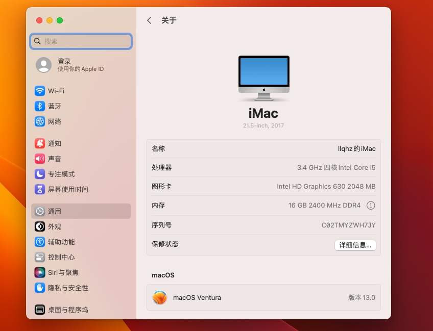

## 联想 启天M415-N000 台式电脑

### 详细配置


```sh
--------[ 鲁大师 ]----------------------------------------------------------------------------------

  软件：                 鲁大师 6.1023.3545.313
  时间：                 2023-03-22 16:48:26
  软件：                 http://www.ludashi.com

--------[ 概览 ]----------------------------------------------------------------------------------

  电脑型号               联想 启天M415-N000 台式电脑
  操作系统               Windows 10 专业版 64位（Version 22H2 / DirectX 12）

  处理器                 英特尔 Core i5-7500 @ 3.40GHz 四核
  主板                   联想 3102（B250 芯片组）
  显卡                   英特尔 HD Graphics 630 ( 128 MB / 联想 )
  内存                   16 GB ( 三星 DDR4 2400MHz 8GB x 2 )
  主硬盘                 希捷 ST1000DM003-1SB102 (1 TB)
  显示器                 DMS2380 241B1S ( 23.8 英寸  )
  声卡                   瑞昱 ALC662 @ 英特尔 High Definition Audio 控制器
  网卡                   瑞昱 RTL8168/8111/8112 Gigabit Ethernet Controller / 联想

--------[ 主板 ]----------------------------------------------------------------------------------

  主板型号               联想 3102
  芯片组                 B250 芯片组
  主板版本               NOK
  BIOS                  联想 M16KT70A  /  BIOS程序发布日期: 11/18/2022
  BIOS的大小             6144 KB

  板载设备               视频设备 (启用)

--------[ 处理器 ]----------------------------------------------------------------------------------

  处理器                 英特尔 Core i5-7500 @ 3.40GHz 四核
  速度                   3.40 GHz
  处理器数量             核心数：4 / 线程数：4
  核心代号               Kaby Lake
  生产工艺               14 nm
  插槽/插座              FCLGA1151
  一级数据缓存           4 x 32 KB, 8-Way, 64 byte lines
  一级代码缓存           4 x 32 KB, 8-Way, 64 byte lines
  二级缓存               4 x 256 KB, 4-Way, 64 byte lines
  三级缓存               6 MB, 12-Way, 64 byte lines
  特征                   MMX, SSE, SSE2, SSE3, SSSE3, SSE4.1, SSE4.2, EM64T, EIST

--------[ 硬盘 ]----------------------------------------------------------------------------------

  产品                   希捷 ST1000DM003-1SB102
  大小                   1 TB
  固件                   CC63
  缓存                   64 MB
  接口                   SATA III
  数据传输率             600.00 MB/秒
  特性                   S.M.A.R.T,  APM,  48-bit LBA,  NCQ
  硬盘已使用             共 520 次，累计 37573 小时
  转速                   7200 转/分

  产品                   联想  SSD SL500 240G (固态硬盘)
  大小                   240 GB
  固件                   Q0526A
  接口                   SATA III
  数据传输率             600 MB/秒
  特性                   S.M.A.R.T,  48-bit LBA,  NCQ
  硬盘已使用             共 330 次，累计 16114 小时

  产品                   闪迪  Ultra
  大小                   31 GB
  接口                   SCSI
  数据传输率             16.7 MB/秒
  特性                   S.M.A.R.T

--------[ 内存 ]----------------------------------------------------------------------------------

  ChannelA-DIMM1         三星 DDR4 2400MHz 8GB
  制造日期               2017 年 42 周
  型号                   M378A1K43CB2-CRC
  序列号                 37238744
  厂商                   SAMSUNG
  模块位宽               64 Bits
  模块电压               SSTL 1.2V

  ChannelB-DIMM1         三星 DDR4 2400MHz 8GB
  制造日期               2017 年 42 周
  型号                   M378A1K43CB2-CRC
  序列号                 37237549
  厂商                   SAMSUNG
  模块位宽               64 Bits
  模块电压               SSTL 1.2V

--------[ 显卡 ]----------------------------------------------------------------------------------

  主显卡                 英特尔 HD Graphics 630
  显存                   128 MB
  显卡制造商             联想
  芯片制造商             Intel
  驱动版本               31.0.101.2111
  驱动日期               20220719

--------[ 显示器 ]----------------------------------------------------------------------------------

  产品                    DMS2380 241B1S
  固件程序日期           2023 年 9 周
  屏幕尺寸               23.8 英寸 (520 毫米 x 310 毫米)
  显示比例               宽屏 16 : 10
  分辨率                 1920 x 1080 32 位真彩色
  Gamma                  2.20
  电源管理               Standby, Suspend, Active-Off

--------[ 其他设备 ]----------------------------------------------------------------------------------

  网卡                   Realtek PCIe GbE Family Controller

  声卡                   瑞昱 ALC662 @ 英特尔 High Definition Audio 控制器

  声卡                   英特尔 英特尔 显示器音频

  键盘                   HID 标准键盘
  键盘                   HID 标准键盘
  鼠标                   HID-compliant 鼠标
  鼠标                   HID-compliant 鼠标

--------[ 传感器 ]----------------------------------------------------------------------------------

  CPU温度                46℃
  CPU核心                47℃
  CPU封装                47℃
  
```

### 效果展示

#### 概览




#### 显示器


#### 声音


#### 网络


### 安装说明

1. 请先升级 BIOS, 详见：[联想官网 BIOS 升级下载](https://newsupport.lenovo.com.cn/driveList.html?fromsource=driveList&selname=M704T6MQ "联想 启天M415-N000 升级 BIOS")
2. 参考**国光的黑苹果安装教程**安装， 详见：[国光的黑苹果安装教程](https://apple.sqlsec.com/ "国光的黑苹果安装教程")
3. 安装时，请添加 `-igfxvesa` 到boot-args，以使显示器能正常展示
4. 安装完成后，替换此EFI文件即可
